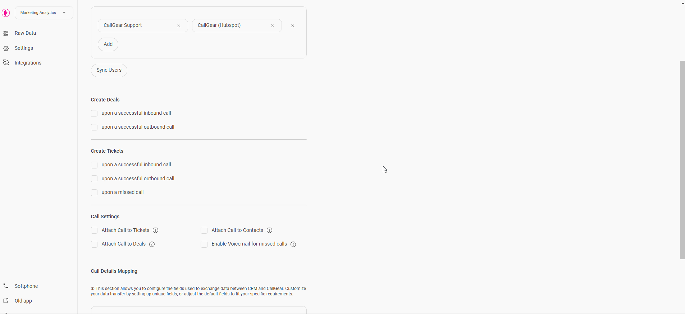

# HubSpot Integration

These instructions are for users who wish to set up an integration between CallGear and HubSpot CRM. Below is the functionality as well as the steps to set up the integration.

## Available Features

Click to expand/collapse

- **Automated Contact and Call Creation**: Easily generate contact and call records during incoming and outgoing calls with seamless automation.
- **Automated Call Routing**: Route calls to the appropriate manager (Сontact Щwner) in HubSpot, ensuring efficient communication management.
- **Deal Creation**: Automatically initiate deals after successful inbound and outbound calls, facilitating a fast sales process.
- **Ticket Creation**: Automate the creation of tickets for successful inbound, outbound or missed calls, providing comprehensive customer support management.
- **Flexible Call Attachment Options**: Customize call attachments by linking call recordings/voicemail and related information to related tickets, deals or contacts.
- **Customized Data Transfer**: Customize how data transfers from CallGear to specific HubSpot fields to improve data integrity.
- **Softphone Widget**: Initiate inbound and outbound calls directly within your CRM system with a convenient Softphone widget, enabling quick and efficient communication with customers and prospects.

## Integration Setup

Initial Setup Steps & CallGear Softphone Widget

### Initial Steps

- **Authorization**:
    - Log into [HubSpot](https://app.hubspot.com/) with your credentials.
    - Save and confirm the connection.
	
	

### CallGear Softphone Widget

1.  **Installation**:
    - Use the [provided link](https://chromewebstore.google.com/detail/callgear/gmepbeelpjhhlnkccmclgijnnleadijl) to download and install the widget.
2.  **Authorization**:
    - Authenticate using your CallGear account credentials.
    - Log in to the installed widget under the same account.
3.  **Functionality Check**:
    - Enable the "Show softphone" option within [HubSpot](https://app.hubspot.com/).
    - Make sure that the widget icon is displayed.
	
	

Integration Settings

### Matching Employee

- Configure a match between CallGear and HubSpot users to automatically route calls to the responsible manager (Contact's owner).

_If the system identifies a HubSpot customer on an incoming call, the call is automatically forwarded to their Contact Owner (personal manager)._

### Data Transfer Setup

- **Call Transfer Control**:
  - Enable or disable the creation of tickets or deals according to your needs.
  - Configure tickets and deals creation settings, including pipeline and stage.
- **Attaching Call Recordings**:
  - Define sources from which you want to receive recordings and call information.
  - Enable feature to automatically attach voicemail recordings to appropriate contacts if voicemail is configured.
  
  

- **Call Details Mapping**:
  - Configure the transfer of call information from CallGear to HubSpot:
    - Choose an object type: Contacts, Deals, Tickets.
    - Select the information you want to transfer from CallGear.
    - Select the field in the HubSpot object to which this information will be transferred.
	
	

## Support

If you encounter any issues or have further questions, please reach out to [CallGear Support](mailto:support@callgear.com) for assistance.
