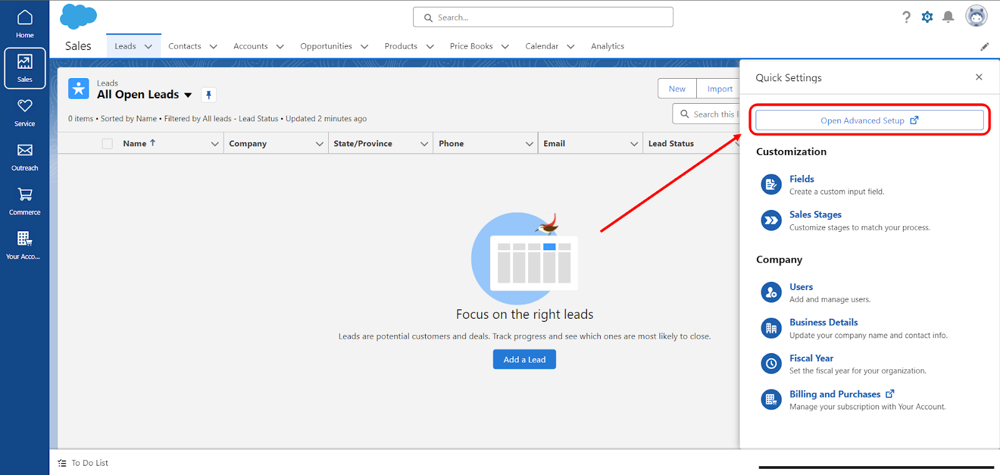
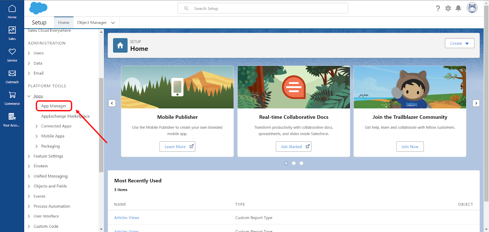
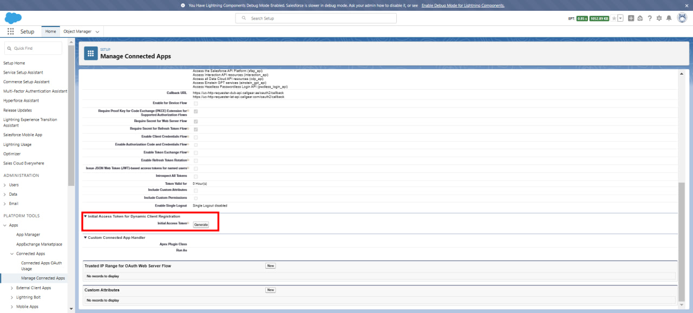
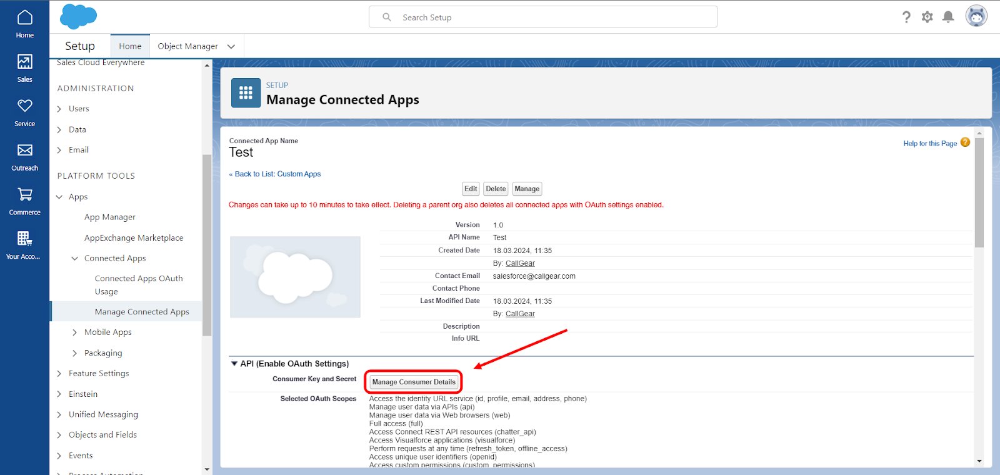
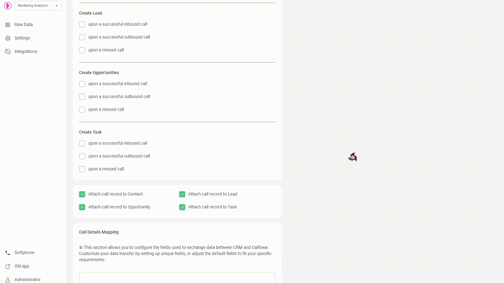
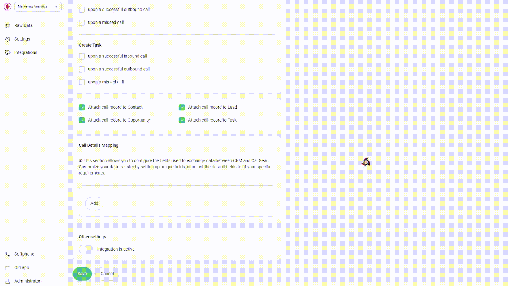

# Salesforce Integration  

These instructions are for users who wish to set up an integration between CallGear and Salesforce CRM. Below is the functionality as well as the steps to set up the integration.

## Available Features  

Click to expand/collapse
  

- **Automated Contact and Lead Creation**: Easily generate contact and lead records during incoming and outgoing calls with seamless automation.
- **Automated Call Routing**: Route calls to the appropriate manager (Сontact/Lead Owner) in Salesforce, ensuring efficient communication management.
- **Opportunity Creation**: Automatically create Opportunity after successful inbound and outbound or missed calls, facilitating a fast sales process.
- **Task Creation**: Automate the creation of tasks for successful inbound, outbound or missed calls, providing comprehensive customer support management.
- **Flexible Call Attachment Options**: Customize call attachments by linking call recordings to related tasks, opportunities, contacts or leads.
- **Customized Data Transfer**: Customize how data transfers from CallGear to specific Salesforce fields to improve data integrity.
- **Softphone Widget**: Initiate inbound and outbound calls directly within your CRM system with a convenient Softphone widget, enabling quick and efficient communication with customers and prospects.

 

---
## Integration Setup  

Salesforce Settings
  

This section guides users on how to create a connected app within Salesforce. A connected app allows external applications to securely integrate with Salesforce using OAuth authentication.

- **Create a Connected App**:
  - Log in to your [Salesforce account](https://login.salesforce.com).
  - Go to advanced settings

- Navigate to Setup > Apps > App Manager.

- Click on 'New Connected App'.

- **Fill in the required details**:
  - Connected App Name: [Your App Name]
  - API Name: [Your_API_Name]
  - Contact Email: [Your Email Address]

- **Enable OAuth Settings: Must be checked**:
  - Callback URL:
    - https://uc-http-requester-dub-api.callgear.ae/oauth2/callback
    - https://uc-http-requester-lat-api.callgear.com/oauth2/callback

- Selected OAuth Scopes: Select required scopes based on your application needs.
- Also unchecking box “Require Proof Key for Code Exchange (PKCE) Extension for Supported Authorization Flows” and save.

- Save the changes.
- After saving, click on the “Initial Access Token” button.

 

Configure OAuth Settings
  

- Once the Connected App is created, note down the 'Consumer Key' and 'Consumer Secret'. These will be used for authentication.

- Under the same Connected App settings, configure the OAuth policies, such as refresh token policy, token validity, etc., according to your requirements.

 

CallGear Credentials Settings
  

#### Set Up Credentials  
  - Log in to your CallGear account using one of these links - https://go.callgear.com/ or https://go.callgear.ae/ 
  - Go to Marketplace and select Salesforce integration
  - Enter your Salesforce account URL and provide the necessary authentication keys from your Salesforce Connected App.

 

Entity Creation Settings (Calls)
  

- **Contact Creation**: 
  - Enable creation of Contact records for inbound and outbound calls.
  - Some opportunities and leads may not be found unless contact creation is enabled. Please enable contact creation to ensure proper automatic tracking and management of opportunities and tasks.  

- **Lead Creation**: 
  - Enable creation of Lead records for successful inbound, outbound and missed calls.
  - Specify the status with which the lead will be created.

 

- **Opportunity Creation**: 
  - Enable creation of Opportunity records for successful inbound, outbound and missed calls.
  - Specify the stage with which the lead will be created.
  - Specify the days until close (close date field of opportunity). Example: if call was made 01.01 and days until close = 14, then close date of opportunity on this call will be 01.15.
  - Opportunity will be created if there are no opportunities in open stage.

 

- **Task (Call log) Creation**: 
  - Enable Task creation for successful inbound, outbound and missed calls.
  - Specify the status and priority with which the task will be created.
  - Task will be created on every call.
  - Task could be attached to a contact or account by specifying it in the settings.
  - To avoid creating tasks for missed outbound calls, the option can be disabled using the checkbox.

 

- **Attachment Creation**: 
  - Enable Attachment creation for successful inbound and outbound calls.
  - If turned on, call record will be loaded into Salesforce as Attachment and connected to chosen entity.

 

- **Call Details Mapping**:
  - Configure the transfer of call information from CallGear to Salesforce:
    - Choose an object type: Contacts, Leads, Opportunities, Tasks.
    - Select the information you want to transfer from CallGear.
    - Select the field in the Salesforce object to which this information will be transferred.

 

Entity Creation Settings (Chats)
  

- **Most settings for creating entities in chats are similar to calls, with a few key differences:**
  

  - Entities are created once per chat session, triggered by either a client or employee first message, regardless of the number of messages exchanged before the chat closes.
    
  - When a client sends the first message, no employee is assigned yet, so an owner can’t be set. The owner is assigned automatically by Salesforce, and can be updated after an employee replies, if enabled in the integration. 
    
  - If the client’s phone number is hidden, only a Task can be created, provided the integration settings allow it. Otherwise, nothing is created.

 

Entity Creation Settings (Inquiries)
  

- **Most settings for creating entities in inquiries are similar to calls, with a few key differences:**
  

  - Owner for new entities could be set only if contact already exists or if default responsible employee is set.
    
  - "Consider employee's schedule" setting allows to specify the task's "due date" field according to employee's schedule in Callgear. Employees are matched by email. 
  Example: Employee has schedule from 10:00 to 18:00 from monday to friday. It's 16:00 of tuesday. Deadline set to 6 hours. Due date will be 14:00 of wednesday.

 

CallGear Softphone Widget
  

1.  **Installation**:
    - Use the <a href="https://chromewebstore.google.com/detail/callgear/gmepbeelpjhhlnkccmclgijnnleadijl" style="color: blue; text-decoration: none;">provided link</a> to download and install the widget.
2.  **Authorization**:
    - Authenticate using your CallGear account credentials.
    - Log in to the installed widget under the same account.
3.  **Functionality Check**:
    - Enable the "Show softphone" option.
    - Make sure that the widget icon is displayed.

 

---

## Support  

If you have any problems or additional questions, please contact <a href="mailto:support@callgear.com" style="color: blue; text-decoration: none;">CallGear Support</a> for assistance.