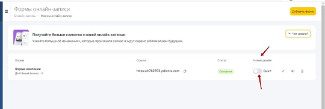
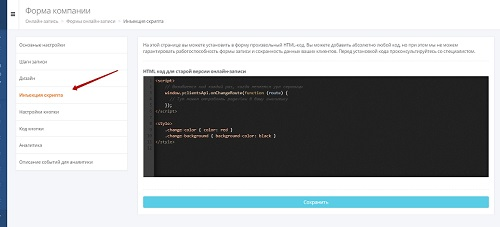
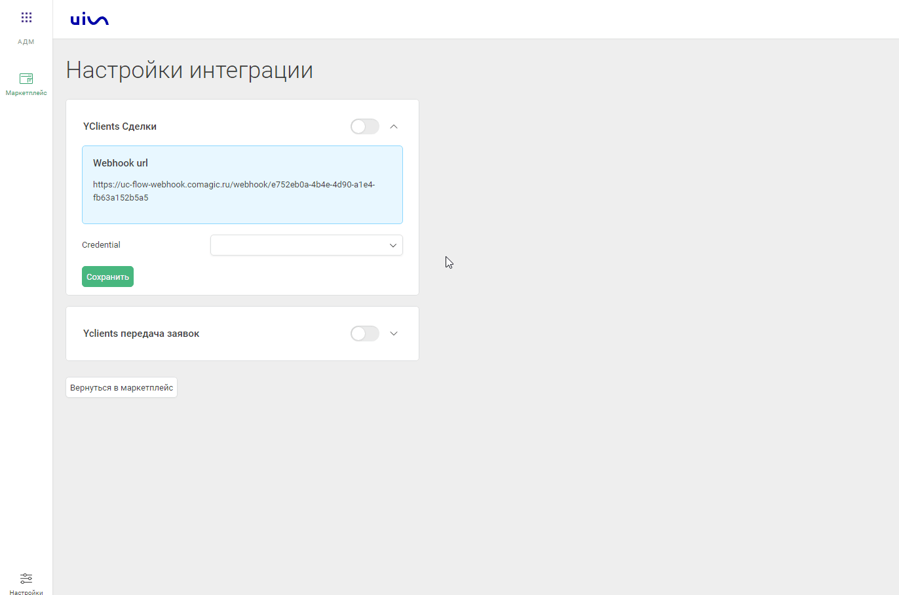

### Интеграция с Yclients   

**Ценность**    

Решение позволяет получать заявки оставленные клиентами в форме Онлайн-виджета и загружать в наш кабинет записи(сделки) из Yclients.    
 
**Какие данные передаются**     

Данные получаемые по заякам:    

- контактные данные (имя,телефон,email);  
- дату и время создания; 
- данные сессии (рекламную кампанию, источник, UTM-метки и тд);  
- в случае отсутствия сессии, дефолтную РК или источник.
  
  

Данные получаемые по сделкам:     
- сделки: сумма сделки, название, даты изменения и тд; 
- воронка продаж и ее этапы;
- контакты;
- ответственный менеджер;
- дополнительные поля.  

 
  
### Подключение интеграции с Онлайн-виджетом.   

**Необходимые кампоненты для работы интеграции**     
- Загрузка оффлайн-заявок из внешней системы.   
  

 
 Шаги по подключению 
  

1. Прожмите переключатель "Yclients передача заявок c Онлайн-виджета", для активации интеграции.  
2. Выполните настройку интеграции.  

- **Настройте Webhook в Yclients**  

 
 Подробнее 
  

Отправка хука настраивается в Yclients через создание собственного приложения, инструкция по созданию находится [по ссылке](https://support.yclients.com/67-68-202?_ga=2.235690817.1118622726.1689663799-975683808.1687778856) .  

- В поле «Адрес, на который отправлять уведомления» укажите url из параметра "Webhook URL".
- В настройке хука в разделе **"Отправлять события по сущностям"** выбираем **"Событие по записям", "Событие по клиентам"**.
  
  

**Важно**: если у клиента несколько филиалов, для каждого необходимо события хука настраивать отдельно, так как настройки для каждого филиала располагаются отдельно друг от друга.  
  
 

 
 

- **Рекламная кампания/источник** — необходимо выбрать какую сущность использовать для обращений без сессии. По умолчанию выбрана Рекламная кампания (маркер не прожат), при прожатии маркера выбирается Источник.  
- В зависимости от положения переключателя "Рекламная кампания/источник" выводится либо список рекламных кампаний из личного кабинета клиента, либо список источников и сайтов. Необходимо указать какую **Рекламную кампанию/источник и сайт** используем в случае отсутствия сессии.  

3. Нажмите сохранить.  
4. После сохранения будет выведен скрипт, который необходимо установить на сайт в соответствие с описанием в настройках. 
   
Данный скрипт устанавливаем на всех страницах сайта, где расположен виджет Yclients, а так же требуется добавить наш скрипт и стандартный код вставки в саму форму в YClients (инъекция скрипта).   

**Важно**: 
   - Инъекция скрипта доступна для всех клиентов в старом дизайне. В новом дизайне Yclients  добавляет данную функцию по запросу.  
       
   - Если клиент на сайт добавляет не виджет Yclients (кнопку), а отдельную ссылку на лендинг, то в этой ссылке необходимо добавить  class="yclick"  
   Пример:  
 
  <Alert backgroundColor="#c3e8d7">
    
   a class="yclick" href="https://n822081.yclients.com/" target="_blank">Открыть новую вкладку</a>
   
 </Alert>    
  
После подключения интеграции сделки будут попадать в  Сырые данные -> Обращения и цели.   
Для проверки корректности работы интеграции оставьте тестовую запись в Онлайн-виджете Yclients.

 
 

  
### Подключение загрузки сделок    

**Необходимые кампоненты для работы интеграции**    
- Сквозная аналитика.   

 
 Шаги по подключению 
  

 
1. Прожмите переключатель "Yclients передача сделок", для активации интеграции.  
2. Выполните настройку интеграции.  

- **Настройте Webhook в Yclients**  

 
 Подробнее 
  

Отправка хука настраивается в Yclients через создание собственного приложения, инструкция по созданию находится [по ссылке](https://support.yclients.com/67-68-202?_ga=2.235690817.1118622726.1689663799-975683808.1687778856) .  

- В поле «Адрес, на который отправлять уведомления» укажите url из параметра "Webhook URL".
- В настройке хука в разделе **"Отправлять события по сущностям"** выбираем **"Событие по записям", "Событие по клиентам"**.
  
  

**Важно**: если у клиента несколько филиалов, для каждого необходимо события хука настраивать отдельно, так как настройки для каждого филиала располагаются отдельно друг от друга.  
  

 
 

- **Авторизация в Yclients**  

 
 Подробнее 
  
 
   - В поле "Credential" нажимаем "Add Credential".
   - В открывшемся окне вводим название, логин от кабинета Yclients (username), пароль от кабинета Yclients(password).
   - Нажимаем клавишу сохранить. 
    

 
 

После подключения интеграции сделки будут попадать в  Сырые данные -> Сделки.   
Для проверки корректности работы интеграции создайте тестовую сделку в Yclients.

 
